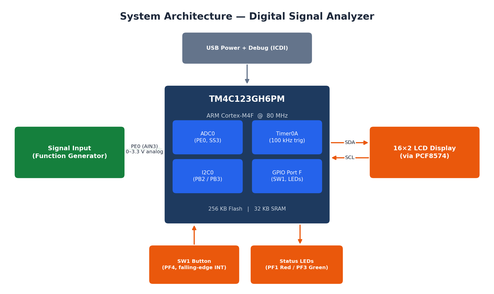
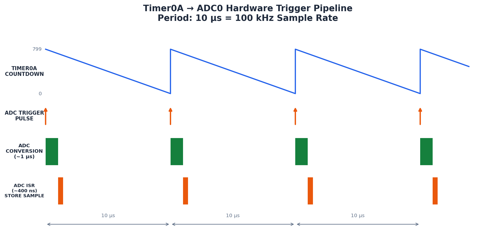
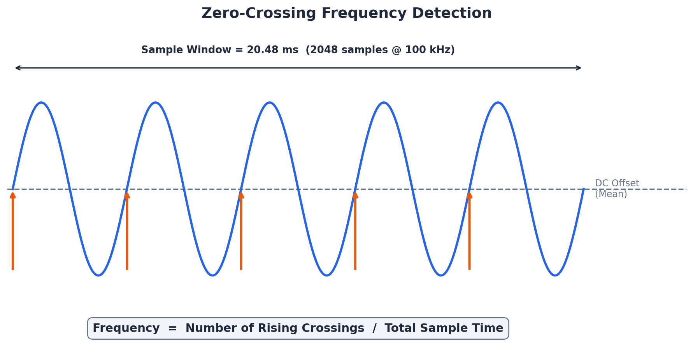

# Digital Signal Analyzer — TM4C123GH6PM Tiva C LaunchPad

Real-time frequency and peak-voltage measurement of an analog signal using hardware-triggered ADC sampling and a zero-crossing detection algorithm, displayed live on a 16×2 character LCD.


<!-- TODO: add your own board photo here as images/hardware_setup.jpg (see note at the bottom of this file) -->


## Table of Contents

- [Overview](#overview)
- [Features](#features)
- [Hardware Used](#hardware-used)
- [System Architecture](#system-architecture)
- [Pin Configuration](#pin-configuration)
- [How It Works](#how-it-works)
- [Software Architecture](#software-architecture)
- [Results](#results)
- [Getting Started](#getting-started)
- [Repository Structure](#repository-structure)
- [Known Limitations](#known-limitations--future-work)
- [References](#references)
- [Authors](#authors)
- [License](#license)

## Overview

This project implements a compact digital signal analyzer on the Texas Instruments **TM4C123GH6PM** (Tiva C LaunchPad, ARM Cortex-M4F). It measures the **frequency (50 Hz – 50 kHz)** and **peak voltage (0 – 3.3 V)** of an analog input signal in real time and displays the results on a 16×2 LCD.

The core idea is to keep signal acquisition entirely in hardware — a Timer0A period triggers ADC0 directly, with zero CPU involvement in the sampling loop — and do the frequency extraction in software using a two-pass zero-crossing algorithm over a fixed-size sample buffer.

Built for the **Embedded Systems and Design (ESD)** course at LNMIIT, Jaipur, under the guidance of Dr. Deepak Nair.

## Features

- **Hardware-triggered ADC0 sampling at 100 kHz** via Timer0A — zero CPU-induced sampling jitter
- **Two-pass zero-crossing detection algorithm** for frequency measurement (50 Hz – 50 kHz range)
- **12-bit peak-voltage measurement** (0 – 3.3 V, ~0.8 mV resolution)
- **16×2 character LCD** output over I2C (PCF8574 backpack, 4-bit HD44780 protocol)
- **Fully interrupt-driven firmware** — GPIO, ADC, and Timer ISRs feeding a foreground/background super-loop
- **Debounced push-button trigger** with dual-LED status indication (measuring / ready)
- Verified **<1% frequency error above 200 Hz** against a bench function generator
- Lightweight footprint — **~8% Flash, ~31% SRAM** utilization, leaving headroom for extensions

## Hardware Used

| Component | Role |
|---|---|
| EK-TM4C123GXL (Tiva C LaunchPad) | Main MCU board — TM4C123GH6PM, ARM Cortex-M4F, on-board ICDI debugger |
| 16×2 LCD (JHD 162A, HD44780-compatible) | Result display |
| PCF8574 I2C I/O expander backpack | Converts I2C serial data → 8 parallel LCD lines (cuts wiring from 11 pins to 2) |
| Function generator | Analog test signal source (sine / square / triangle) into PE0 |
| Breadboard + jumper wires | Prototyping / signal routing |

## System Architecture



The TM4C123GH6PM is the central processing unit. It reads the analog signal on **ADC0 (PE0 / AIN3)**, drives the LCD over **I2C0 (PB2 = SCL, PB3 = SDA)**, and handles user interaction through **GPIO Port F** (SW1 push button, red/green status LEDs). The board is powered and programmed over USB via the on-board ICDI debug probe.

## Pin Configuration

| Pin | Function | Peripheral | Direction |
|---|---|---|---|
| PE0 | Analog signal input | ADC0 (AIN3) | Input |
| PB2 | I2C clock (SCL) | I2C0 | Output |
| PB3 | I2C data (SDA) | I2C0 | Bidirectional |
| PF1 | Red LED (measuring) | GPIO | Output |
| PF3 | Green LED (ready) | GPIO | Output |
| PF4 | SW1 push button | GPIO (interrupt) | Input |

## How It Works

### 1. Sampling strategy

The system captures **2048 samples at 100 kHz**, giving a 20.48 ms measurement window. This buffer size trades off frequency resolution (1 / 0.02048 s ≈ 48.8 Hz) against SRAM usage (2048 × 4 bytes = 8 KB of 32 KB available). A 100 kHz sample rate satisfies the Nyquist criterion for input signals up to 50 kHz.

### 2. Timer0A → ADC0 hardware trigger pipeline



Timer0A runs as a 32-bit periodic down-counter with a load value derived from the system clock and target sample rate:

```
Load = f_sys / f_sample − 1 = 80,000,000 / 100,000 − 1 = 799
```

`TimerControlTrigger()` routes the timer's timeout directly to ADC0 as a hardware trigger, so every 10 µs a conversion starts with **no CPU intervention** — this is what makes the sampling jitter-free. Each completed conversion fires `ADC0_SS3_ISR`, which must finish in under 10 µs to avoid missing the next sample; in practice it completes in well under 1 µs.

### 3. Zero-crossing frequency detection



Frequency is extracted with a two-pass scan of the 2048-sample buffer:

- **Pass 1** — scan all samples to find the maximum ADC value (→ peak voltage) and the arithmetic mean (→ DC offset, used as the zero-crossing threshold).
- **Pass 2** — count *rising* zero-crossings: transitions where consecutive samples move from below the mean to above it. Each complete cycle of a periodic signal produces exactly one rising crossing.

```
f = N_crossings / T_total,        T_total = 2048 / 100,000 = 0.02048 s
V_peak = (max_ADC / 4095) × 3.3 V
```

| Parameter | Value | Explanation |
|---|---|---|
| Minimum frequency | ~50 Hz | Needs ≥ 1 full cycle inside the 20.48 ms window |
| Maximum frequency | 50 kHz | Nyquist limit: 100 kHz / 2 |
| Frequency resolution | ~48.8 Hz | 1 / 0.02048 s — the measured frequency is always a multiple of this |
| Voltage resolution | ~0.8 mV | 3.3 V / 4096 levels |
| Voltage range | 0 – 3.3 V | ADC reference voltage |

## Software Architecture

The firmware follows a **foreground/background** pattern: the main loop (foreground) polls flags that two ISRs (background) set.

**`SwitchISR`** (GPIO Port F) — fires on the falling edge of PF4 (SW1 press), clears the interrupt, sets `g_startRequest`, and applies a ~7.5 ms software debounce.

**`ADC0_SS3_ISR`** (ADC Sequencer 3) — fires 100,000 times/second from the timer-ADC hardware pipeline, reads the FIFO, stores the sample, and sets `g_samplingDone` once 2048 samples are collected. All shared state (`g_adcBuffer`, `g_sampleIndex`, `g_samplingDone`, `g_startRequest`) is `volatile` so the compiler never caches it in registers across the ISR/main-loop boundary.

**Main loop**, once `g_startRequest` is set:
1. Enable the ADC interrupt and start Timer0A.
2. Busy-wait until the 2048-sample buffer is full (~20.48 ms).
3. Disable the timer and ADC interrupt.
4. Call `ProcessSignal()` to compute frequency and peak voltage.
5. Format and print both values to the LCD.
6. Turn the green LED back on — ready for the next measurement.

## Results

The analyzer was tested against a bench function generator at 100 Hz, 500 Hz, 1 kHz, 5 kHz, and 10 kHz (sine, square, and triangle waves). Readings agreed with the source frequency to **under 1% error above 200 Hz**.

<!-- TODO: add your own LCD-readout photos here as images/result_1khz_sine.jpg and images/result_5khz_square.jpg -->
| 1 kHz sine input | 5 kHz square input |
|---|---|
|  |  |
| Displays **976.6 Hz** (20 crossings × 48.83 Hz) | Displays **4.88 kHz** (100 crossings × 48.83 Hz) |

> Measured values differ slightly from the true input frequency because the zero-crossing algorithm has a fixed resolution of Δf ≈ 48.8 Hz — every reading is quantized to a multiple of this step.

### Resource Utilization

| Resource | Used | Available | Utilization |
|---|---|---|---|
| Flash (Code) | ~20 KB | 256 KB | ~8% |
| SRAM (Data) | ~10 KB | 32 KB | ~31% |
| ADC Modules | 1 (ADC0) | 2 | 50% |
| Timer Modules | 1 (Timer0) | 6 | 17% |
| I2C Modules | 1 (I2C0) | 4 | 25% |
| GPIO Ports | 3 (B, E, F) | 6 | 50% |

## Getting Started

### Prerequisites

- [Code Composer Studio (CCS)](https://www.ti.com/tool/CCSTUDIO) — TI's standard IDE for TM4C12x parts
- [TivaWare™ for C Series](https://www.ti.com/tool/SW-TM4C) — peripheral driver library (`driverlib`), required by `main.c`'s includes
- An EK-TM4C123GXL LaunchPad (or equivalent TM4C123GH6PM board)
- A 16×2 HD44780 LCD with a PCF8574 I2C backpack, and a function generator for testing

### Build & flash

1. Create a new CCS project targeting the **TM4C123GH6PM** device / EK-TM4C123GXL board.
2. Add `src/main.c` to the project and link it against TivaWare's `driverlib`.
3. Wire the hardware per the [Pin Configuration](#pin-configuration) table above.
4. Build and flash over USB via the on-board ICDI debug probe.
5. Power up, press **SW1** to start a measurement, and read the result off the LCD.

> This repository contains the firmware source only (no `.ccsproject` files), so it drops straight into a fresh CCS project rather than assuming a particular workspace layout.

## Repository Structure

```
.
├── README.md
├── LICENSE
├── src/
│   └── main.c                      # Complete firmware source
├── images/
│   ├── system_architecture.png     # Recreated block diagram
│   ├── timer_adc_pipeline.png      # Recreated timing diagram
│   ├── zero_crossing_detection.png # Recreated algorithm diagram
│   ├── hardware_setup.jpg          # Add your own board photo
│   ├── result_1khz_sine.jpg        # Add your own LCD photo
│   └── result_5khz_square.jpg      # Add your own LCD photo
└── docs/
    └── ESD_Report_Digital_Signal_Analyzer.pdf   # Add the full report PDF here (optional)
```

## Known Limitations / Future Work

- Frequency resolution is fixed at ~48.8 Hz (inherent to the 2048-sample / 100 kHz window); a larger buffer or interpolation between samples would improve it at the cost of SRAM or complexity.
- Single-channel only — no simultaneous multi-signal capture.
- The button ISR sets `g_startRequest` unconditionally; it doesn't yet suppress a re-trigger while a measurement is already in progress.
- The main loop busy-waits (`while (!g_samplingDone) {}`) instead of sleeping the CPU during acquisition — fine here since the MCU has nothing else to do, but worth revisiting for a lower-power design.
- No FFT / harmonic analysis — only fundamental frequency and peak amplitude.


## License

Released under the [MIT License](LICENSE).

---

*Diagrams in `images/` (system architecture, timer-ADC pipeline, zero-crossing detection) are recreated from the project report's content for this repository. The three photographs (`hardware_setup.jpg`, `result_1khz_sine.jpg`, `result_5khz_square.jpg`) referenced above are placeholders — drop your own board/LCD photos into `images/` with those filenames before pushing. The full report PDF is likewise not bundled here; add it to `docs/` if you'd like it alongside the code.*
